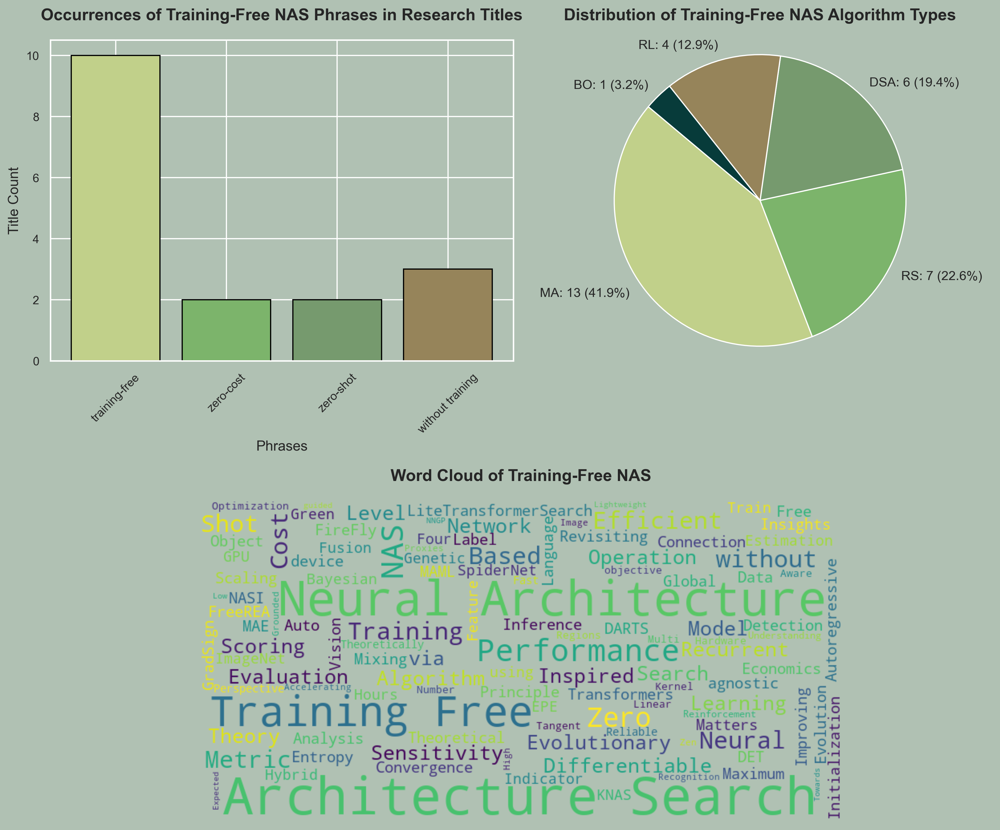

# Training-Free-NAS

[Training-Free Neural Architecture Search: A Review](https://doi.org/10.1016/j.icte.2023.11.001)

Training-Free Neural Architecture Search (NAS) is an innovative approach within the field of NAS  that aims to streamline the process of discovering optimal neural network architectures without relying on traditional training paradigms.

Unlike conventional NAS methods that involve iterative training and evaluation of numerous architectures to identify the best-performing one, training-free NAS explores architectures without training. Instead, it often leverages training-free score functions, zero-cost proxies, or analytical methods to estimate or directly predict the performance of neural network architectures, significantly reducing computational overhead and resource requirements.

These methods are designed to accelerate the architecture search process, making it more efficient, cost-effective, and accessible for researchers and practitioners. Training-free NAS contributes to advancing the field of deep learning by expediting the discovery of novel architectures and facilitating their deployment in various domains, including computer vision, natural language processing, etc.

This repository serves as a curated collection of research papers and benchmarks dedicated to training-free NAS, aiming to provide a comprehensive resource for understanding, exploring, and evaluating these innovative approaches in NAS.

## Training-Free NAS Papers

|  RS  |   BO  |   RL   |   DSA   |   MA   |
|:--------|:--------|:--------|:--------|:--------|
| Random Search | Bayesian Optimization | Reinforcement Learning | Differentiable Search Algorithm | Metaheuristic Algorithm |

|  Title  |   Venue  |   Type   |   Code   |   Year  |
|:--------|:--------:|:--------:|:--------:|:--------:|
| [A Training-Free Neural Architecture Search Algorithm based on Search Economics](https://ieeexplore.ieee.org/abstract/document/10092788) | TEVC | MA | [GitHub](https://github.com/cwtsaiai/TNASSE) | 2023 
| [Connection Sensitivity Matters for Training-free DARTS: From Architecture-Level Scoring to Operation-Level Sensitivity Analysis](https://arxiv.org/abs/2106.11542) | arXiv | DSA | - | 2023
| [FreeREA: Training-Free Evolution-Based Architecture Search](https://openaccess.thecvf.com/content/WACV2023/html/Cavagnero_FreeREA_Training-Free_Evolution-Based_Architecture_Search_WACV_2023_paper.html) | WACV | MA | [GitHub](https://github.com/NiccoloCavagnero/FreeREA) | 2023
| [Zero-Cost Operation Scoring in Differentiable Architecture Search](https://arxiv.org/abs/2106.06799) | arXiv | DSA | [GitHub](https://github.com/zerocostptnas/zerocost_operation_score) | 2023
| [Auto-Scaling Vision Transformers without Training](https://arxiv.org/abs/2202.11921) | ICLR | RL | [GitHub](https://github.com/VITA-Group/AsViT) | 2022 |
| [GradSign: Model Performance Inference with Theoretical Insights](https://arxiv.org/abs/2110.08616) | ICLR | RS | [GitHub](https://github.com/cmu-catalyst/GradSign) | 2022 |
| [Global Convergence of MAML and Theory-Inspired Neural Architecture Search for Few-Shot Learning](https://openaccess.thecvf.com/content/CVPR2022/html/Wang_Global_Convergence_of_MAML_and_Theory-Inspired_Neural_Architecture_Search_for_CVPR_2022_paper.html) | CVPR | DSA | [GitHub](https://github.com/YiteWang/MetaNTK-NAS) | 2022 |
| [Improving Neural Architecture Search by Mixing a FireFly Algorithm with a Training Free Evaluation](https://doi.org/10.1109/IJCNN55064.2022.9892861) | IJCNN | MA | [GitHub](https://github.com/nassimmokhtari/Improved-FireFly-Algorithm) | 2022 |
| [LiteTransformerSearch: Training-free On-device Search for Efficient Autoregressive Language Models](https://openreview.net/forum?id=H0Rydmbzf3) | AutoML-Conf | MA | [GitHub]() | 2022 |
| [MAE-DET: Revisiting Maximum Entropy Principle in Zero-Shot NAS for Efficient Object Detection](https://arxiv.org/abs/2111.13336) | ICML | MA | [GitHub](https://github.com/alibaba/lightweight-neural-architecture-search) | 2022 |
| [NASI: Label- and Data-agnostic Neural Architecture Search at Initialization]() | ICLR | DSA | [SM](https://openreview.net/attachment?id=v-v1cpNNK_v&name=supplementary_material) | 2022 |
| [SpiderNet: Hybrid Differentiable-Evolutionary Architecture Search via Train-Free Metrics](https://openaccess.thecvf.com/content/CVPR2022W/NAS/html/Geada_SpiderNet_Hybrid_Differentiable-Evolutionary_Architecture_Search_via_Train-Free_Metrics_CVPRW_2022_paper.html) | CVPR | MA and DSA | [GitHub](https://github.com/RobGeada/SpiderNet-NTKLRC) | 2022 |
| [A Training-Free Genetic Neural Architecture Search](https://dl.acm.org/doi/abs/10.1145/3491396.3506510) | ICEA | MA | - | 2021 |
| [A Feature Fusion Based Indicator for Training-Free Neural Architecture Search](https://doi.org/10.1109/ACCESS.2021.3115911) | IEEE Access | MA | - | 2021 |
| [Bayesian Neural Architecture Search using a Training-Free Performance Metric](https://doi.org/10.1016/j.asoc.2021.107356) | ASOC | BO | [GitHub](https://github.com/acamero/dlopt) | 2021 |
| [EPE-NAS: Efficient Performance Estimation Without Training for Neural Architecture Search]() | ICANN | RS | [GitHub](www.github.com/VascoLopes/EPE-NAS) | 2021 |
| [KNAS: Green Neural Architecture Search](https://proceedings.mlr.press/v139/xu21m.html) | ICML | RS | [GitHub](https://github.com/Jingjing-NLP/KNAS) | 2021 |
| [Neural Architecture Search on ImageNet in Four GPU Hours: A Theoretically Inspired Perspective](https://arxiv.org/abs/2102.11535) | ICLR | DSA | [GitHub](https://github.com/VITA-Group/TENAS) | 2021 |
| [Neural Architecture Search without Training](https://proceedings.mlr.press/v139/mellor21a.html) | ICML | RS | [GitHub](https://github.com/BayesWatch/nas-without-training) | 2021 |
| [Reliable and Fast Recurrent Neural Network Architecture Optimization](https://arxiv.org/abs/2106.15295) | arXiv | MA | - | 2021 |
| [Training-Free Multi-objective Evolutionary Neural Architecture Search via Neural Tangent Kernel and Number of Linear Regions](https://link.springer.com/chapter/10.1007/978-3-030-92270-2_29) | ICONIP | MA | [GitHub](https://github.com/TuDo1403/TF-MOENAS) | 2021 |
| [Training-Free Hardware-Aware Neural Architecture Search with Reinforcement Learning](https://doi.org/10.5909/JBE.2020.26.7.855) | JBE | RL | - | 2021 |
| [Understanding and Accelerating Neural Architecture Search with Training-Free and Theory-Grounded Metrics](https://arxiv.org/abs/2108.11939) | arXiv | MA and RL | [GitHub](https://github.com/VITA-Group/TEGNAS) | 2021 |
| [Zen-NAS: A Zero-Shot NAS for High-Performance Image Recognition](https://openaccess.thecvf.com/content/ICCV2021/html/Lin_Zen-NAS_A_Zero-Shot_NAS_for_High-Performance_Image_Recognition_ICCV_2021_paper.html) | ICCV | MA | [GitHub](https://github.com/idstcv/ZenNAS) | 2021 |
| [Zero-Cost Proxies for Lightweight NAS](https://arxiv.org/abs/2101.08134) | ICLR | RS,RL, and MA | [GitHub](https://github.com/SamsungLabs/zero-cost-nas) | 2021 |
| [Towards NNGP-guided Neural Architecture Search](https://arxiv.org/abs/2011.06006) | arXiv | RS | [GitHub](https://github.com/google-research/google-research/tree/master/nngp_nas) | 2020 |
| [Low-Cost Recurrent Neural Network Expected Performance Evaluation](https://arxiv.org/abs/1805.07159) | arXiv | RS | - | 2018 |

## NAS Benchmarks

|  Title  |  Venue  |  Unique Architectures  |  Code  |
|:--------|:--------:|:--------:|:--------:|
| [NAS-Bench-101: Towards Reproducible Neural Architecture Search](https://proceedings.mlr.press/v97/ying19a.html) | ICML | 423.6k | [Github](https://github.com/google-research/nasbench) |
| [NAS-Bench-201: Extending the Scope of Reproducible Neural Architecture Search](https://arxiv.org/abs/2001.00326) | ICLR | 6.5k | [Github](https://github.com/D-X-Y/NAS-Bench-201) |
| [NATS-Bench: Benchmarking NAS Algorithms for Architecture Topology and Size](https://ieeexplore.ieee.org/abstract/document/9336247) | TPAMI | 6.5k+32.8k | [Github](https://github.com/D-X-Y/NATS-Bench) |
| [NAS-Bench-301 and the Case for Surrogate Benchmarks for Neural Architecture Search ](https://arxiv.org/abs/2008.09777) | arXiv | 10^18+60k | [Github](https://github.com/automl/nasbench301) |
| [NAS-Bench-1Shot1: Benchmarking and Dissecting One-shot Neural Architecture Search](https://arxiv.org/abs/2001.10422) | ICLR | 14.6k | [Github](https://github.com/automl/nasbench-1shot1) |
| [NAS-Bench-NLP: Neural Architecture Search Benchmark for Natural Language Processing](https://ieeexplore.ieee.org/abstract/document/9762315) | IEEE Access | 14k | [Github](https://github.com/fmsnew/nas-bench-nlp-release) |
| [TransNAS-Bench-101: Improving Transferability and Generalizability of Cross-Task Neural Architecture Search](http://openaccess.thecvf.com/content/CVPR2021/html/Duan_TransNAS-Bench-101_Improving_Transferability_and_Generalizability_of_Cross-Task_Neural_Architecture_Search_CVPR_2021_paper.html) | CVPR | 7.3k | [VEGA]( https://www.noahlab.com.hk/opensource/vega/page/doc.html?path=datasets/transnasbench101) |
| [NAS-Bench-360: Benchmarking Neural Architecture Search on Diverse Tasks](https://proceedings.neurips.cc/paper_files/paper/2022/hash/506630e4a43bb9d64a49f98b9ba934e9-Abstract-Datasets_and_Benchmarks.html) | NeurIPS | 15.6k | [Github](https://github.com/rtu715/NAS-Bench-360) |
| [NAS-Bench-Zero: A Large Scale Dataset for Understanding Zero-Shot Neural Architecture Search](https://openreview.net/forum?id=hP-SILoczR) | - | 14.9k+10.1k+9.7k | - |
